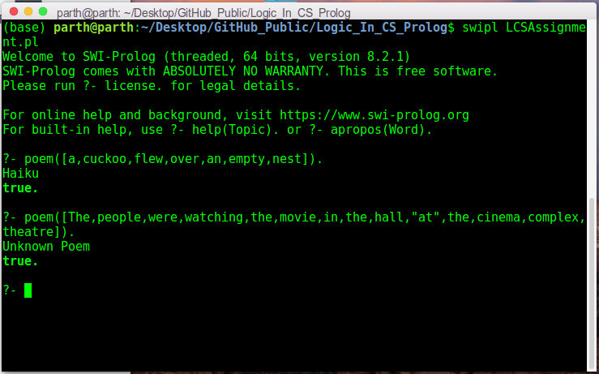

# Logic in Computer Science - Prolog Assignment

This repo contains my solutions for assignment of on-campus course Logic in Computer Science (CS F214). The assignment needs to be implemented in Prolog. The file description is as follow:

1. `lics-assign-problem3.pdf`: It contains the problem statement - write a Prolog program that will classify a given poem as a haiku, doha, quartet, fusion sonnet or unknown. It also defines the terms haiku, doha, quartet, and fusion sonnet. 
2. `LCSAssignment.pl`: It contains the Prolog program.
3. `Code_Description.txt`: It explains the meaning of different predicates used in the Prolog program.
4. `Test_Inputs.txt`: It contains sample test inputs and outputs for the Prolog program.

You can install SWI-Prolog on Ubuntu 16.04 from [here](https://www.swi-prolog.org/build/PPA.html).

Use the following command to run the Prolog program:
```sh
swipl LCSAssignment.pl
```

The following is a screenshot demonstrating the working of the Prolog program:


This assignment was done in a team of two, with my partner being [Aashish Singh](https://github.com/Aashish683).

